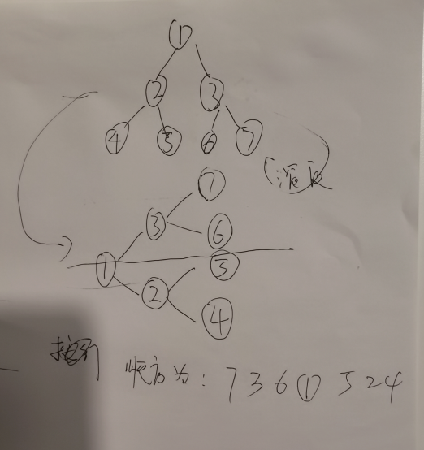

###day07本包主要包含二叉树的相关问题 
1. 二叉树的深度优先遍历(递归)：先序遍历，中序遍历，后续遍历,,
   Code01；
2. 二叉树的深度优先遍历（非递归）：先序遍历，中序遍历，后续遍历Code02；
3. 二叉树的宽度优先遍历,Code03;
4. 求二叉的最大宽度和深度,Code04;
5. 序列化和反序列二叉树（中序优先不可以）,Code05;
6. 图像化顺时针旋转打印一颗二叉树，遍历二叉树并统计当前节点的深度，图：，Code06;
7、折纸问题-中序遍历满二叉树问题

